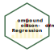

# CPN  

## Compound Poisson-Normal Regression

The Compound Poisson-Normal model is used to model data that consist of a 
random number of additive, continuous outcomes. In this model, the number of 
events follows a Poisson distribution, while the size of each event is drawn 
from a Normal distribution. The total observed value is the sum of these 
normally distributed amounts. This model is useful for describing aggregated 
outcomes with both random frequency and variation in magnitude, such as 
healthcare costs, environmental measurements, or biological signals. 


## Installation

Install the current development version from GitHub with:

```r
if (!require("remotes")) install.packages("remotes")
remotes::install_github("laszlopecze77/CPN")
```
## Getting Started

See the [introductory vignette](https://laszlopecze77.github.io/CPN/articles/CPN-vignette.html).


## Citing `CPN`

To cite `CPN` please see [here](https://laszlopecze77.github.io/CPN/authors.html#citation).

## Development

Development dependencies:

- R version >= 4.5.0
- For windows machines, rtools45
  (<https://cran.rstudio.com/bin/windows/Rtools/rtools45/rtools.html>)
- package`roxygen2` version 7.3.2 for the documentation.
- package `Rdpack` for the citation within function documentation.
- package `devtools` to ease the development.
- package `rmarkdown` for the vignettes.
- package `sessioninfo` version 1.2.2 if running under windows.
  See current issue <https://github.com/r-lib/sessioninfo/issues/112>.
