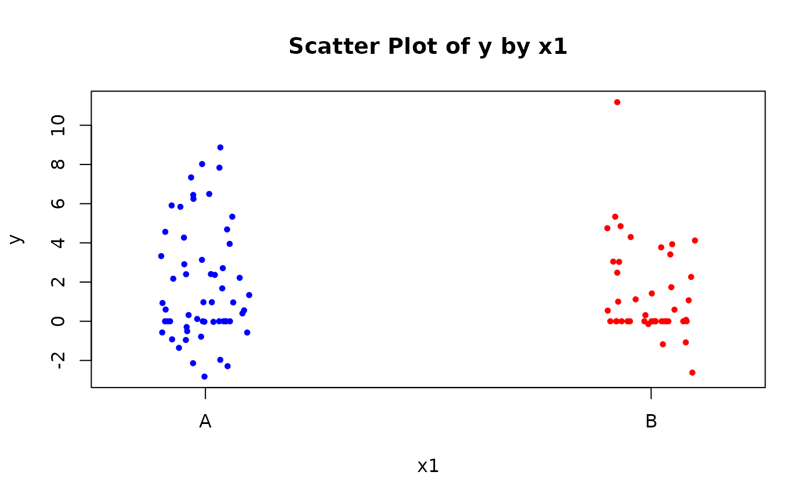

# Compound Poisson-Normal Regression

## Introduction

In many applied settings—including insurance claims, biological systems,
and environmental monitoring—the observed data arise from a random
number of additive events, where each event contributes a continuous
value. A natural model for such data is the **Compound Poisson-Normal
(CPN)** distribution.

The CPN model assumes that the number of events follows a Poisson
distribution, and that each event contributes an independent and
identically distributed (i.i.d.) **normally distributed** amount.

Formally, let:

- $N \sim \text{Poisson}(\lambda)$ denote the number of events,
- $X_{1},X_{2},\ldots,X_{N}\overset{\text{i.i.d.}}{\sim}\mathcal{N}\left( \mu,\sigma^{2} \right)$,
  independent of $N$,

Then the total observed outcome is modeled as a **compound sum**:

$$Y = \sum\limits_{i = 1}^{N}X_{i}$$

The resulting distribution of $Y$ is known as the **Compound
Poisson-Normal distribution**.

The first two moments of the CPN distribution are:

$${\mathbb{E}}\lbrack Y\rbrack = \lambda\mu,\quad\text{Var}(Y) = \lambda\left( \mu^{2} + \sigma^{2} \right)$$

These follow from the properties of the compound distribution, combining
Poisson and Gaussian contributions. The (approximate) probability
density function (pdf) of $Y$ is:

$$f_{Y}(y;\lambda,\mu,\sigma) = \begin{cases}
{e^{- \lambda},} & {{\text{if}\mspace{6mu}}y = 0} \\
 & \\
{\sum\limits_{k = 1}^{K_{\text{max}}}\frac{e^{- \lambda}\lambda^{k}}{k!} \cdot \frac{1}{\sqrt{2\pi k\sigma^{2}}}\exp\left( - \frac{(y - k\mu)^{2}}{2k\sigma^{2}} \right),} & {{\text{if}\mspace{6mu}}y \neq 0}
\end{cases}$$

**Where:**

- $y$: the observed total from the compound process  
- $\lambda$: expected number of Poisson events  
- $\mu$: mean of each normal component  
- $\sigma$: standard deviation of each normal component  
- $k$: number of events (from 1 to $K_{\text{max}}$)  
- $K_{\text{max}}$: maximum number of events used in the approximation

When $k = 0$, the sum is defined as a point mass at zero, and its
probability is:

$$P(Y = 0) = P(N = 0) = e^{- \lambda}$$

In theory, the compound distribution sums over an infinite range of
possible Poisson event counts. In practice, this sum must be
**truncated** at a finite maximum value $K_{\max}$, chosen so that the
remaining tail probability is negligible.

## Getting Started

To use the function, load the package:

``` r
library(CPN)
# Registered S3 method overwritten by 'CPN':
#   method         from
#   plot.mcmc.list coda
```

## Simulating Data

We’ll simulate a dataset that mimics typical CPN behavior. This includes
both categorical and continuous predictors, and outcomes generated via a
Poisson count of normally distributed values.

``` r
set.seed(123)
data <- simulate_cpn_data()
head(data)
#            y x1          x2
# 1 -0.5703738  A  0.25331851
# 2  0.0000000  A -0.02854676
# 3  0.9613621  A -0.04287046
# 4  5.3350483  B  1.36860228
# 5  3.1328607  A -0.22577099
# 6 -2.6186645  B  1.51647060
```

## Plot the simulated data

Visualize the response y against predictor x2, colored by group x1.

``` r
# Scatter plot of y vs x1
stripchart(
  y ~ x1, data = data,
  vertical = TRUE, method = "jitter",
  pch = 19, cex = 0.6,
  col = c("blue",  "red"),
  xlab = "x1", ylab = "y",
  main = "Scatter Plot of y by x1"
)
```



## Fit the CPN Model

Fit a Compound Poisson-Normal regression model to the data using a
standard formula interface. The response variable y is modeled as a
function of predictors x1 (categorical) and x2 (continuous).

``` r
fit <- cpn(y ~ x1 + x2, data = data)
```

## Summary of Results

Get a summary of the fitted model, including coefficient estimates,
standard errors, z-values, and p-values. The summary also includes
estimates of the mu and sigma parameters (mean and SD of the normal
component) and model fit statistics like AIC.

``` r
summary(fit)
# Call:
# cpn(formula = y ~ x1 + x2, data = data)
# 
# Deviance Residuals:
#    Min     1Q Median     3Q    Max 
# -2.871 -2.059 -1.269  2.181  3.745 
# 
# Coefficients:
#             Estimate Std.Error z.value      Pr.z    
# (Intercept)  0.63754   0.15190  4.1969 2.705e-05 ***
# x1B         -0.60713   0.22934 -2.6473  0.008114 ** 
# x2           0.53609   0.10791  4.9679 6.767e-07 ***
# ---
# Signif. codes:  0 '***' 0.001 '**' 0.01 '*' 0.05 '.' 0.1 ' ' 1
# 
# Estimated mu parameter: 0.9600
# Estimated sigma parameter: 1.7062
# 
# Null deviance: 478.20 on 99 degrees of freedom
# Residual deviance: 449.74 on 95 degrees of freedom
# AIC: 459.74
```

## Extracting Model Components

You can directly access key components of the fitted model object:

``` r
fit$coefficients
# (Intercept)         x1B          x2 
#   0.6375359  -0.6071284   0.5360923
fit$mu
#        mu 
# 0.9599623
fit$sigma
#    sigma 
# 1.706243
fit$fitted_values[1:10]  # preview only
#  [1] 2.0802264 1.7884887 1.7748077 2.0611074 1.6090445 2.2311441 0.4313962
#  [8] 1.3538511 1.9407450 2.0389587
```

## Coefficients and Interpretation

Use coef() to extract model coefficients. Setting full = FALSE shows
only the linear predictor coefficients (excluding auxiliary parameters
like mu and sigma).

``` r
coef(fit)
# (Intercept)         x1B          x2          mu       sigma 
#   0.6375359  -0.6071284   0.5360923   0.9599623   1.7062428
coef(fit, full = FALSE)  # Includes only linear predictors
# (Intercept)         x1B          x2 
#   0.6375359  -0.6071284   0.5360923
```

## Diagnostics and Residuals

Basic diagnostic plots and residuals help check model fit and detect
issues like non-linearity or outliers.

``` r
plot(fit)
```


``` r
residuals(fit)[1:10]
#  [1] -2.215482 -1.930328 -1.997946  2.411580  2.145066 -2.766042  2.737024
#  [8]  2.297386 -2.398468 -2.008626
```

## Likelihood and Information Criteria

These metrics are useful for comparing model fit.
[`logLik()`](https://rdrr.io/r/stats/logLik.html) gives the
log-likelihood, [`AIC()`](https://rdrr.io/r/stats/AIC.html) the Akaike
Information Criterion (lower is better), and
[`vcov()`](https://rdrr.io/r/stats/vcov.html) returns the
variance-covariance matrix of the parameters.

``` r
logLik(fit)
# 'log Lik.' -224.8705 (df=5)
AIC(fit)
# [1] 459.741
vcov(fit)
#              (Intercept)          x1B           x2           mu        sigma
# (Intercept)  0.023075014 -0.018395473 -0.002512385 -0.010214396 -0.007321724
# x1B         -0.018395473  0.052596614  0.000287386  0.002777711 -0.001478573
# x2          -0.002512385  0.000287386  0.011644724 -0.002747529 -0.001565976
# mu          -0.010214396  0.002777711 -0.002747529  0.027438819  0.008114203
# sigma       -0.007321724 -0.001478573 -0.001565976  0.008114203  0.033661888
```

## Type I Analysis of Deviance

The function `anova(fit)` provides a sequential (Type I) analysis of
deviance.  
This examines the incremental contribution of each predictor to the
model’s fit, based on the order in which they appear in the formula.

``` r
anova(fit)
#       Term     Df Deviance Resid. Df Resid. Dev   Pr(>Chi) Signif
#  Residuals                        97      478.2                  
#         x1      1   6.7993        96      471.4  0.0091193     **
#         x2      1   21.657        95     449.74 3.2607e-06    ***
# ---
# Signif. codes:  0 '***' 0.001 '**' 0.01 '*' 0.05 '.' 0.1 ' ' 1
```

## Model Update and Comparison

You can update a model (e.g., remove predictors) and compare nested
models using the likelihood ratio test:

``` r
fit2 <- update(fit, . ~ . - x2)

anova(fit, fit2)  # Likelihood ratio test
#    Model Resid. Df Resid. Dev     Df Deviance   Pr(>Chi) Signif
#  Model 1        95     449.74                                  
#  Model 2        96      471.4      1   21.657 3.2607e-06    ***
# ---
# Signif. codes:  0 '***' 0.001 '**' 0.01 '*' 0.05 '.' 0.1 ' ' 1
```

## Prediction

Once you have fitted a Compound Poisson-Normal (CPN) regression model
using the
[`cpn()`](https://laszlopecze77.github.io/CPN/reference/cpn.md)
function, you can generate predictions on both the **original data** and
**new observations** using the
[`predict()`](https://rdrr.io/r/stats/predict.html) method for `cpn`
objects.

This method supports three prediction types:

- **“link”**: Returns the linear predictor $\eta = X\beta$.
- **“rate”**: Returns the rate component $\exp(\eta)$, representing the
  expected number of latent events.
- **“response”**: Returns the expected response
  ${\mathbb{E}}\lbrack Y\rbrack = \mu \cdot \exp(\eta)$, combining the
  frequency and magnitude components of the compound distribution.

Additionally, confidence intervals can be requested using the
`interval = "confidence"` argument, which computes approximate
**normal-theory confidence intervals** using the **delta method**.

### Predicting on the Original Data

By default, [`predict()`](https://rdrr.io/r/stats/predict.html) uses the
original dataset used for model fitting. You can obtain point estimates
or confidence intervals for the fitted values.

``` r
# Point predictions on the response scale
predict(fit, type = "response")[1:5]
# [1] 2.080226 1.788489 1.774808 2.061107 1.609045

# Confidence intervals for response predictions
predict(fit, type = "response", interval = "confidence")[1:5, ]
#        fit       lwr      upr
# 1 2.080226 1.1475902 3.012863
# 2 1.788489 0.9814659 2.595511
# 3 1.774808 0.9733248 2.576291
# 4 2.061107 0.8876666 3.234548
# 5 1.609045 0.8722838 2.345805
```

### Predicting on New Data

To make predictions on new data, provide a `data.frame` to the `newdata`
argument. The function will internally align factor levels and construct
the appropriate model matrix.

``` r
# Define new observations
new_df <- data.frame(
  x1 = c("A", "A", "B", "B"),
  x2 = c(-0.5, -0.2, -0.3, -0.3)
)

# Predictions on the link scale (linear predictor η)
predict(fit, newdata = new_df, type = "link", interval = "confidence")
#          fit         lwr       upr
# 1  0.3694897  0.03861794 0.7003615
# 2  0.5303174  0.22324817 0.8373866
# 3 -0.1304202 -0.52855693 0.2677165
# 4 -0.1304202 -0.52855693 0.2677165

# Predictions on the rate scale (exp(η))
predict(fit, newdata = new_df, type = "rate", interval = "confidence")
#         fit      lwr      upr
# 1 1.4469960 1.039373 2.014481
# 2 1.6994716 1.250131 2.310321
# 3 0.8777265 0.589455 1.306976
# 4 0.8777265 0.589455 1.306976

# Predictions on the response scale (μ × exp(η))
predict(fit, newdata = new_df, type = "response", interval = "confidence")
#         fit       lwr      upr
# 1 1.3890617 0.7318477 2.046276
# 2 1.6314287 0.8861812 2.376676
# 3 0.8425844 0.4024248 1.282744
# 4 0.8425844 0.4024248 1.282744
```

### Confidence Intervals

When `interval = "confidence"` is used:

- On the **link** and **rate** scales, confidence intervals are based
  solely on the uncertainty in the regression coefficients ($\beta$).
- On the **response** scale, the intervals additionally incorporate
  uncertainty in the mean magnitude parameter ($\mu$) using the **delta
  method**:

$$\text{SE}\left\lbrack \mu \cdot \exp(\eta) \right\rbrack \approx \sqrt{\left( \mu \cdot \exp(\eta) \right)^{2} \cdot \text{Var}\lbrack\eta\rbrack + \left( \exp(\eta) \right)^{2} \cdot \text{Var}\lbrack\mu\rbrack}$$

This provides a more accurate reflection of total uncertainty when
predicting expected values of the compound outcome.

\`\`\`

## Conclusion

The `CPN` package enables effective modeling of semicontinuous data
using the Compound Poisson-Normal model. It supports flexible model
specification, S3 methods for diagnostics and inference, and prediction
on new data. For more advanced use, refer to the function documentation
or the package reference manual.

## References

D. C. Nascimento, Abraão, Leandro C. Rêgo, and Raphaela L. B. A.
Nascimento. 2019. “Compound Truncated Poisson Normal Distribution:
Mathematical Properties and Moment Estimation.” *Inverse Problems &Amp;
Imaging* 13 (4): 787–803. <https://doi.org/10.3934/ipi.2019036>.

Hu, Haoran, Xinjun Wang, Site Feng, Zhongli Xu, Jing Liu, Elisa
Heidrich-O’Hare, Yanshuo Chen, et al. 2024. “A Unified Model-Based
Framework for Doublet or Multiplet Detection in Single-Cell Multiomics
Data.” *Nature Communications* 15 (1): 5562.

Raqab, Mohammad Z, Debasis Kundu, and Fahimah A Al-Awadhi. 2021.
“Compound Zero-Truncated Poisson Normal Distribution and Its
Applications.” *Communications in Statistics-Theory and Methods* 50
(13): 3030–50.
